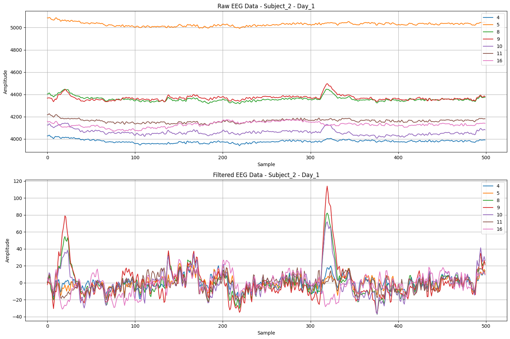
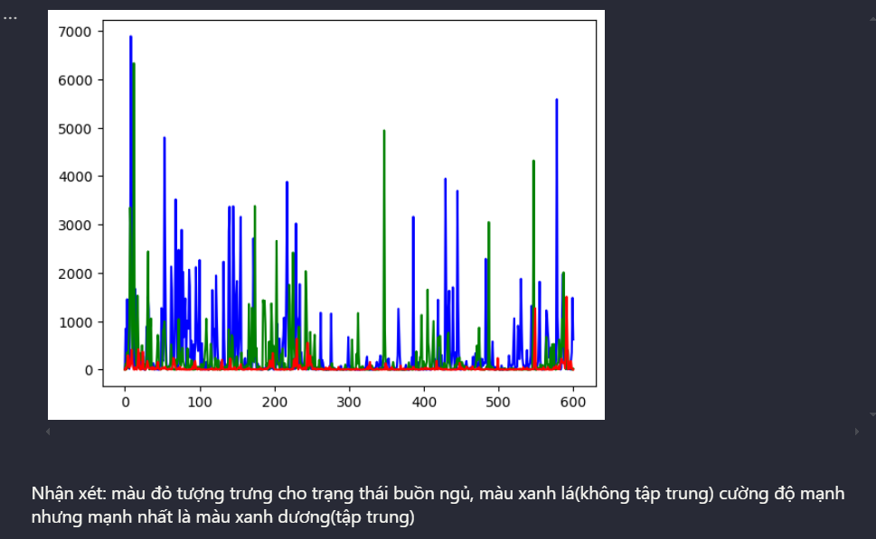

# Mental Attention States Classification Using EEG Data
---

## Team Members
---

- **22280001**: Lê Quốc An
- **22280014**: Nguyễn Công Tiến Dũng *(Team Leader)*
- **22280061**: Lê Hoàng Nguyên
- **22280067**: Nguyễn Thiên Phúc

## Introduction
---
Classify mental attention states (focused, unfocused, drowsy) based on EEG signals using advanced machine learning techniques. This project demonstrates our ability to handle complex datasets, apply innovative preprocessing methods, and implement cutting-edge models for classification tasks.

## Project Information
---
- **Course**: Pattern Recognition & Machine Learning
- **Dataset Source**: [Kaggle](https://www.kaggle.com/datasets/inancigdem/eeg-data-for-mental-attention-state-detection/data)

## Key Contributions
---
### **1. Data Preprocessing**
- Extracted and loaded data from Matlab files.
- Selected relevant channels (4-17) for analysis.
- Applied advanced preprocessing techniques such as filtering, normalization, and scaling to enhance signal quality.
- **Visualization**: Comparison of signal quality before and after filtering noise (frequency range: 0.5 to 40 Hz) for 7 channels:

### **2. Feature Engineering**
- Utilized Short-Time Fourier Transform (STFT) to transform data from the time domain to the time-frequency domain.
- Compared features across attention states to identify distinct patterns.

### **3. Machine Learning Models**
- Implemented and optimized various models for classification:
  - **SVM** with RBF kernel
  - **CNN**, **CRNN**, and **Transformer** architectures

### **4. Evaluation**
- Conducted rigorous evaluation using metrics such as accuracy and F1-score:

| **Metrics** | **SVM** | **CNN** | **CRNN** | **Enhanced CRNN** | **Transformer** |
|-------------|---------|---------|----------|-------------------|-----------------|
| **Accuracy** | 0.60    | 0.86    | 0.89     | **0.93**          | 0.86            |
| **F1-Score** | 0.60    | 0.86    | 0.89     | **0.93**          | 0.86            |

## Achievements
---
- Successfully distinguished between focused, inattentive, and drowsy states with high accuracy.
- Enhanced CRNN model achieved **93% accuracy**, showcasing our ability to innovate and improve existing architectures.
- Demonstrated expertise in preprocessing, feature extraction, and model optimization.

## Skills Demonstrated
---
- **Data Analysis**: Proficient in handling EEG data and applying preprocessing techniques.
- **Machine Learning**: Skilled in implementing and optimizing SVM, CNN, CRNN, and Transformer models.
- **Team Collaboration**: Worked effectively in a team to achieve project goals.
- **Problem Solving**: Tackled challenges in data quality and model performance.

## Conclusion
---
This project highlights our ability to leverage machine learning techniques to classify mental attention states accurately. By combining preprocessing, feature extraction, and advanced models, we achieved significant results, with the Enhanced CRNN model standing out as the most effective.
